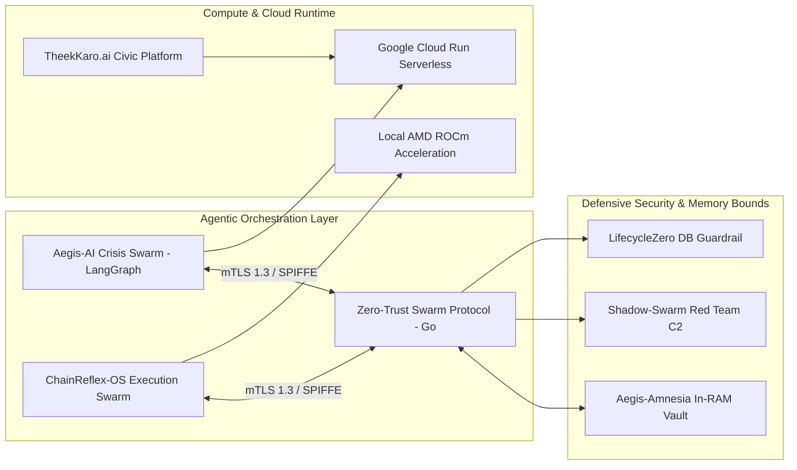

# Hamza Imran

<p align="left">
  <a href="https://hamza-premium-portfolio-2026.vercel.app/"></a>
  <a href="https://www.linkedin.com/in/hamza-imran-17569b383/"></a>
  <a href="mailto:hamza135252@gmail.com"></a>
  <a href="https://github.com/HamzaKhanBUIC"></a>
</p>

```text
╭──────────────────────────────────────────────────────────────────────────────╮
│  HAMZA IMRAN // CYBERSECURITY & AI SYSTEMS                                   │
├──────────────────────────────────────────────────────────────────────────────┤
│  • IDENTITY   : Cybersecurity Undergrad @ Air University Karachi, Pakistan   │
│  • CORE FOCUS : Zero-Trust Inter-Agent Protocols & Ephemeral Memory Bounds   │
│  • RUNTIMES   : Go (mTLS 1.3), Python (LangGraph), AMD ROCm & Cloud Run      │
│  • PHILOSOPHY : Zero Implicit Trust. Reproducible Code. Memory Safety.       │
╰──────────────────────────────────────────────────────────────────────────────╯
```

---

### What I Do

I study Cyber Security at Air University in Karachi and build software for **autonomous multi-agent systems** and **defensive security**.

Most multi-agent frameworks today assume everyone on the network is friendly. They pass raw prompts over open HTTP connections and leave API keys unencrypted in RAM. I build tools that fix those weak points—using mutual TLS 1.3, in-memory cryptographic zeroization, and deterministic guardrails so agent swarms coordinate safely.

---

### System Architecture: The Zero-Trust Multi-Agent Mesh



---

### Tech Stack & Tools

<p align="left">
  
</p>

---

### Core Projects

| Project | What it does | Stack | Links |
| :--- | :--- | :--- | :--- |
| **[Zero-Trust Swarm Protocol](https://github.com/HamzaKhanBUIC/Zero-Trust-Swarm-Protocol)** | Hardened mTLS 1.3 transport layer for AI agents with SPIFFE workload attestation and OpenTelemetry tracing. | `Go`, `mTLS 1.3`, `SPIFFE`, `Docker` | [Repository](https://github.com/HamzaKhanBUIC/Zero-Trust-Swarm-Protocol) |
| **[Aegis-AI Crisis Swarm](https://github.com/HamzaKhanBUIC/Aegis-AI-The-Omni_Crisis-Intelligence-Swarm)** | Decentralized multi-agent swarm that triages disaster reports, calculates safe routes, and syncs with responders offline. | `Python`, `LangGraph`, `Llama-3-70B`, `Flutter` | [Repository](https://github.com/HamzaKhanBUIC/Aegis-AI-The-Omni_Crisis-Intelligence-Swarm) |
| **[ChainReflex-OS](https://github.com/HamzaKhanBUIC/ChainReflex-OS)** | Multi-agent execution runtime mapping parallel LLM reasoning graphs directly to local AMD ROCm GPU compute. | `TypeScript`, `Python`, `AMD ROCm`, `Docker` | [Repository](https://github.com/HamzaKhanBUIC/ChainReflex-OS) |
| **[TheekKaro.ai](https://github.com/HamzaKhanBUIC/TheekKaro.ai)** | AI-powered civic complaint router for municipal hazards, running serverless on Google Cloud Run. | `Python`, `Google Cloud Run`, `Docker` | [Repository](https://github.com/HamzaKhanBUIC/TheekKaro.ai) • [Live App](https://theekkaro-engine-900492834451.us-central1.run.app/) |
| **[doc-intel-platform](https://github.com/HamzaKhanBUIC/doc-intel-platform)** | Financial document intelligence platform with deterministic schema validation and multi-way ERP reconciliation. | `JavaScript`, `Node.js`, `FastAPI`, `OCR` | [Repository](https://github.com/HamzaKhanBUIC/doc-intel-platform) |
| **[VeriVoice](https://github.com/HamzaKhanBUIC/Veri-Voice-Unesco-Hackathon)** | Voice biometrics and synthetic media defense platform built for the UNESCO Hackathon to catch acoustic deepfakes. | `Next.js 14`, `FastAPI`, `Python` | [Repository](https://github.com/HamzaKhanBUIC/Veri-Voice-Unesco-Hackathon) • [Live Demo](https://verivoice-unesco.vercel.app/) |

---

<details>
<summary><b>🔬 Click to inspect: Systems & Security Deep Dives</b></summary>
<br/>

- **[Aegis-Amnesia](https://github.com/HamzaKhanBUIC/aegis-amnesia)**: Cryptographic in-RAM memory vault for AI agents. Encrypts context fragments with AES-256-GCM and explicitly overwrites key buffers with random entropy when tasks finish so secrets can't be scraped from memory dumps.
- **[Shadow-Swarm](https://github.com/HamzaKhanBUIC/shadow-swarm)**: Automated red-teaming C2 framework that stress-tests LLM guardrails against multi-turn jailbreaks and prompt injection.
- **[Procedural Genomic Sequence Parser](https://github.com/HamzaKhanBUIC/Procedural-Genomic-Sequence-Parser)**: Pure procedural C++ parser for multi-gigabyte DNA datasets. $O(N)$ linear-time base counting with zero dynamic heap allocations during iteration loops.
- **[LifecycleZero](https://github.com/HamzaKhanBUIC/LifecycleZero-Database-Level-Local-AI-Governance-Threat-Isolation)**: Database-layer guardrail that intercepts LLM SQL mutations and contains prompt-injection escalation at the query boundary.

</details>

---

### Activity & Stats

<p align="left">
  
  
</p>

---

### Engineering Principles

1. **Evidence over claims**: If a repo doesn't have reproducible code or a working demo, it doesn't belong in my showcase.
2. **Zero implicit trust**: Every agent, API call, and memory buffer should be authenticated, scoped, and verifiable.
3. **Keep it simple**: Clean procedural code and minimal dependencies beat heavy abstractions when performance and security matter.

---

> [!NOTE]
> Open to research collaborations and engineering discussions in **Zero-Trust Multi-Agent Architectures**, **AI Safety Guardrails**, and **Hardware-Accelerated Agent Runtimes**. Reach out via [email](mailto:hamza135252@gmail.com) or [LinkedIn](https://www.linkedin.com/in/hamza-imran-17569b383/).
